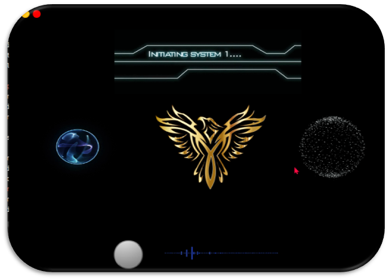

# Phoenix-The-Virtual-Assistant
This is the repository for Phoenix-The Virtual Assistant

# Main Screen

# Modules
<pre>
1. Tell date
2. Tell time
3. Launch app
4. Open website
5. Tell Weather
6. Wikipedia search
7. Tell News
8. Play Music
9. YouTube search
10. Tell Joke
11. Tell location of a place
12. IP address
13. Switch window
14. Tell my location
15. Take a screenshot
16. Hide all files
17. Make files visible
18. Calculate
19. Computational Intelligence
20. Goodbye/you can sleep now/wake up
21. Shutdown/restart system
22. Remember stuff
23. Who are you/ Who made you
24. wish me
25. Birthday Wishes
</pre>
# Libraries (modules) Used
<pre>
PyQt5
random
pyjokes
time
pyautogui
pywhatkit
wolframalpha
PIL
os
re
sys
speech_recognition
pyttsx3
datetime
future
pytz
pickle
googleapiclient
selenium
subprocess
requests
geopy
geocoder
webbrowser
json
wikipedia
urllib

API(s) Used:
wolfram alpha API
OpenWeather API
</pre>

# Installation
<pre>
&emsp;1. Open the Folder and then do shift-right click; then open command window here.
&emsp;2. Create virtual environment and then install all modules from requirements.txt.
&emsp;3. Also install pyaudio using whl given in repo, or download your own for your specific python version.
&emsp;4. Run main.py using this venv.
</pre>
        
# Thank You
        

